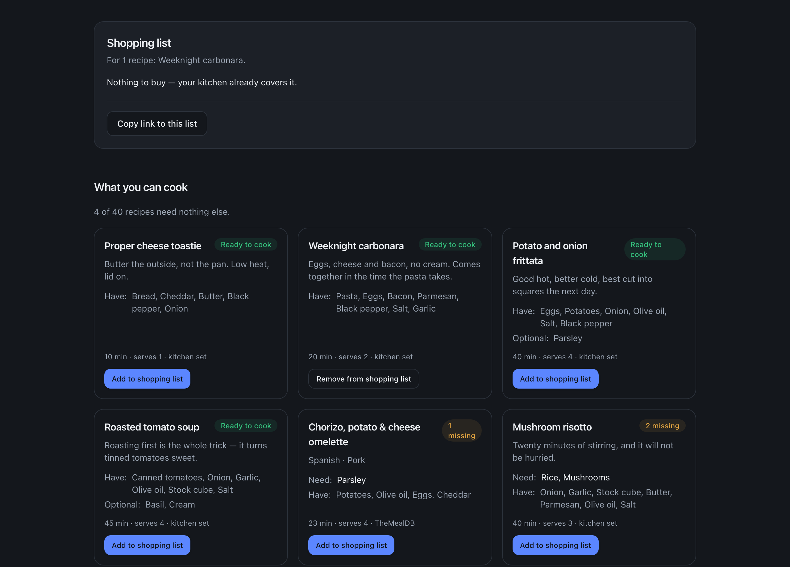

# Pantry

Tick off what is in your kitchen and see what you can cook tonight. Every
recipe is scored against your pantry on the server, and the list comes back
with the smallest shopping trip first — "Ready to cook" means nothing else is
needed.



## Live demo

Not deployed yet. The app renders on a server — filtering, streaming and
revalidation all happen there — so a static host would strip out the part
worth looking at. `vercel.json` is committed and the production build is
green; publishing is one `vercel` login away and nothing else.

To see it as it ships, run the production build locally:

```bash
npm ci && npm run build && npm start
```

## What it does

- **Tick what you have.** 67 everyday ingredients, grouped the way a kitchen
  is. Search when typing beats scanning.
- **Read the gap, not the recipe.** Each card lists what is missing and what
  you already have. Optional garnishes are shown but never counted against a
  recipe.
- **Pick a few, take the list.** The shopping list merges the picked recipes,
  adds up duplicate amounts and subtracts your pantry. Same ingredient in a
  different unit stays on its own line rather than being converted with a
  guess.
- **Share it.** The pantry and the selection live in the URL, so a link
  reopens the exact same state for anyone — no account, no server-side
  session.

24 recipes ship with the app; the rest come from
[TheMealDB](https://www.themealdb.com/api.php). When that API is down the page
says so and falls back to the local set.

## What happens where

The interesting part of this project is the split, so here it is with numbers
from the production build (`npm run build && npm start`, measured on the home
page with an empty pantry):

| | Over the wire |
|---|---|
| HTML — the fully matched 40-recipe list | **16 KB** (163 KB uncompressed) |
| JavaScript — framework runtime plus four client islands | **147 KB** across 9 files |
| CSS | **6 KB** |

What is *not* in that JavaScript is the point. The recipe catalogue and the
matching code never reach the browser: the server holds both recipe sources,
scores them against the pantry and sends the finished list as markup. The
remote half of that catalogue alone is **547 KB of JSON** (124 KB gzipped)
that the server fetches, uses and throws away — a browser-side version of this
app would have to download all of it before it could render a single result.

The browser gets four small islands and nothing else: the ingredient picker
(which only writes the querystring), the "add to shopping list" button, the
copy-link button and the theme toggle.

Concretely:

- **Server components** do the filtering. `matchRecipes` runs per request; the
  browser receives a list, not a database.
- **Streaming.** The header, the hero and the picker are flushed immediately;
  the recipe list arrives behind a skeleton of its own shape once both recipe
  sources have answered, so nothing shifts when it lands.
- **The URL is the state.** `?have=…&picked=…` is parsed and validated on the
  server against the ingredient catalogue, so a hand-edited link cannot inject
  anything unknown. Local storage keeps a copy so a bare link restores your
  last pantry — but a link that carries a pantry always wins, because opening
  someone else's selection has to show theirs.
- **Recipe pages are pre-rendered.** The 24 local recipes are built as static
  pages and revalidated hourly (`generateStaticParams` + `revalidate`);
  anything pulled from the open database is rendered on demand and cached
  after the first visit.

## Stack

Next.js 16 (App Router), React 19, TypeScript, Tailwind CSS 4. Tests with
Vitest and Testing Library. No state manager and no data-fetching library —
the URL and the server cover both jobs.

## Running it

```bash
npm ci
npm run dev        # http://localhost:3000
```

```bash
npm run lint       # eslint
npm run typecheck  # tsc --noEmit
npm test           # vitest
npm run build      # production build
```

Everything works offline: if TheMealDB cannot be reached, the app uses the
recipes that ship with it and says so on the page.

## Deploy

The app needs a Node server — Vercel is the path of least resistance and
`vercel.json` is already committed (framework, install and build commands,
`fra1` region):

```bash
npx vercel --prod
```

Set `NEXT_PUBLIC_SITE_URL` to the deployed origin (e.g.
`https://pantry.vercel.app`). It is what puts the live link in the footer and
gives the recipe pages an absolute `rel=canonical`; without it both are left
out rather than pointed at localhost.

Any host that runs `next start` works too:

```bash
npm ci && npm run build && npm start
```

A static export is deliberately not offered: it would drop the server-side
filtering, the streaming and the revalidation, which is most of what this
project is.

## Layout

```
src/app        routes: the home page, recipe pages, the revalidate handler
src/components pantry/  the app's own components
               site/    page chrome (header, hero, sections, footer)
               …        shared UI primitives
src/lib/pantry types, matching, URL state, the recipe sources
src/data       the recipe and ingredient catalogue that ships with the app
```
